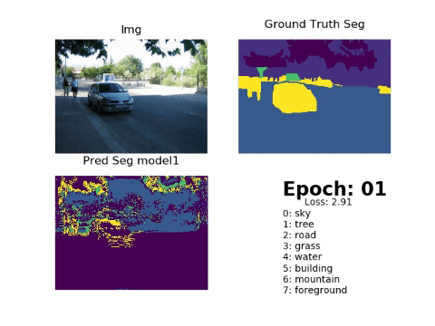

# What this Repo is about
Semantic Segmentation is done by assigning each pixel in the image a class. This is a key problem in th field of computer vision. In this repo, we would look at using UNet to do this:



# How to set up
## what you need
Anaconda (download from [here](https://anaconda.org/anaconda/python))

## steps
1. Clone the Repo
1. open a terminal (bash) <br>

In bash type the following
```bash
cd UNet
conda env create -f=environment.yml # this would download the necessary python packages from anaconda cloud
conda activate my_unet
cd data
tar -xvzf iccv09Data.tar.gz
mv iccv09Data raw # renames folder to raw for data integrity
cd ..
python src/processing.py
python src/train_unet.py
```
## To Launch Jupyter notebook
type the following in your bash
```bash
jupyter notebook
```
## Test data
After running src/train_unet.py, you should have some weights. You can run the follwing step to see your results.
```bash
python src/load_weights_and_test.py -w <PATH OF TRAINED MODEL>
```
# Data
The data is taken from ICCV09 [1] which contains 715 images sourced from LabelMe, MSRC, PASCAL VOC, and Geometric Context. Labels were obtained using Amazon's Mechanical Turk (AMT). Data can be downloaded from [here](http://dags.stanford.edu/projects/scenedataset.html) <br>

The labels are:

  - horizons.txt         : image dimensions and location of horizon
  - labels/*.regions.txt : integer matrix indicating each pixel's
                           semantic class (sky, tree, road, grass,
                           water, building, mountain, or foreground
                           object). A negative number indicates
                           unknown.
 - labels/*.surfaces.txt : integer matrix indicating each pixel's
                           geometric class (sky, horizontal, or
                           vertical).
 - labels/*.layers.txt   : integer matrix indicating distinct
                           image regions.

# What is UNet?
[UNet](https://arxiv.org/abs/1505.04597)[2] is Convolutional Neural Network (CNN) which builds on the well known [FCN](https://people.eecs.berkeley.edu/~jonlong/long_shelhamer_fcn.pdf)[3]. Compared to the [traditional sliding window approach](http://people.idsia.ch/~juergen/nips2012.pdf), which won the Electron Microscopy Segmentation challenge at [ISBI 2012](http://brainiac2.mit.edu/isbi_challenge/home), the FCN pose a more elegant architecture which reduces redundant overlapping patches its predecessor had. <br>

The Unet consists of 23 convolutional layers with one contraction and one, more or less symmetric, expansion path. A concatenation of high resolution features from the contracting path to the unsampled features from the expanding path allows for localization. <br>

The UNet architecture can be seen below <br>


# Training
In this repo, we would be using a small version of UNet and train it over 50 epoch. The accuracy_loss_plot is shown below <br>
### Accuracy plot
[Accuracy plot](https://rawgit.com/notha99y/SemanticSegmentation/master/plots/acc.html)

### Loss plot
[Loss plot](https://rawgit.com/notha99y/SemanticSegmentation/master/plots/acc.html)

# Reference
[1] Decomposing a Scene into Geometric and Semantically Consistent Regions, Stephen Gould, Richard Fulton, Daphne Koller, ICCV 2009

[2] U-Net: Convolutional Networks for Biomedical Image Segmentation. Olaf Ronneberger, Philipp Fischer, Thomas Brox

[3] Fully Convolutional Networks for Semantic Segmentation. Jonathan Long, Evan Shelhamer, Trevor Darrell. UN Berkeley
